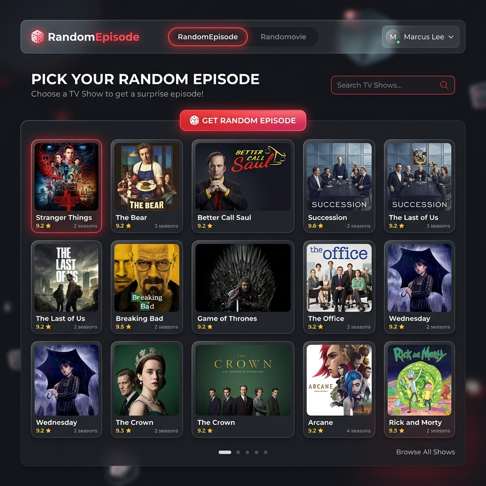
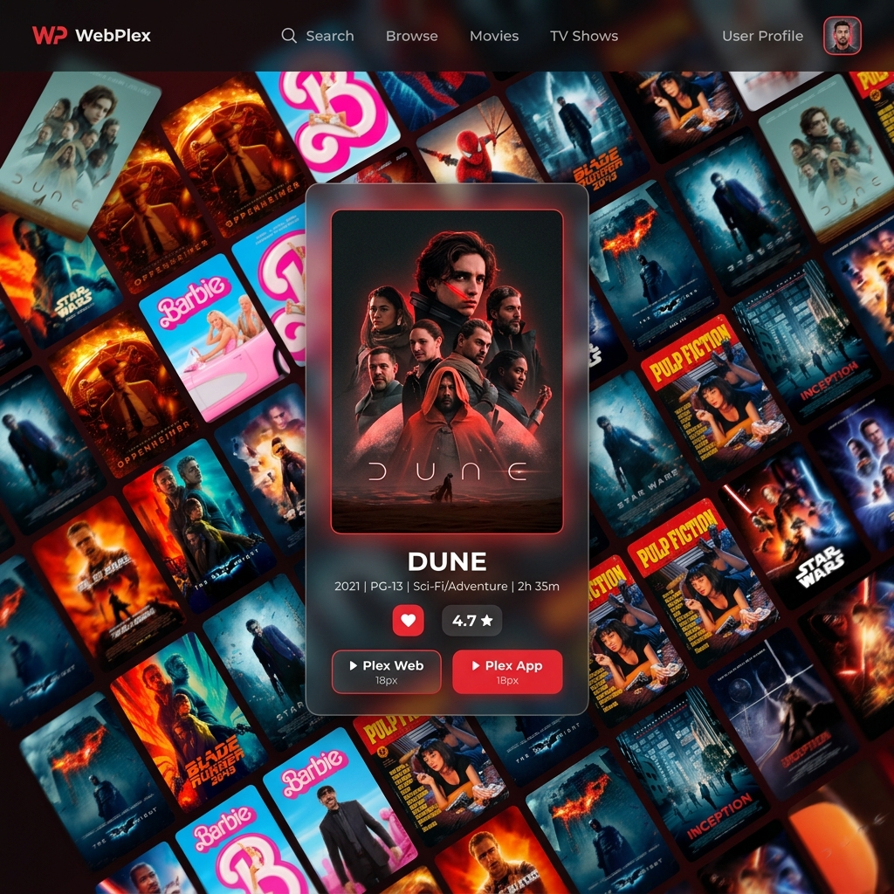

# RandomEpisode & Randomovie for Plex 🎲🍿

A sleek, self-hosted web application that connects to your personal Plex server. It allows you to browse your TV show and Movie libraries to pick **truly random content** to watch, keeping track of your watched history so you never get the same thing twice!

Perfect for when you just want to put on a background show (like *The Office* or *The Simpsons*) or when you can't decide which movie to watch for movie night.

## 📺 RandomEpisode Mode

Pick a random episode from any of your TV shows.
- **Smart Memory System**: Keeps a local SQLite database of episodes you've already rolled, ensuring you get a fresh episode every time. 
- **Auto-Reset with Memory**: Once you watch every episode of a show, the system resets the pool but **intelligently excludes the 30% most recently watched episodes** so you don't get episodes that are too fresh in your mind.

## 🎬 Randomovie Mode

Can't decide what movie to watch? Randomovie to the rescue.
- **Animated Movie Collage**: Features a stunning, infinite diagonal scrolling collage of all your movie posters.
- **Advanced Filtering**: Filter your random roll by **Library**, **Genre**, or **Decade** using our beautiful touch-friendly floating menus.
- **Compact Floating Player**: The randomly selected movie appears in a sleek floating card without obscuring the background collage.
- **Favorites Carousel**: Found a movie you love but want to watch it later? Heart it! Your favorites appear in a horizontally scrollable carousel for easy access.

## ✨ General Features

- **Plex Integration**: Automatically fetches all your libraries, series, movies, and metadata directly from your Plex server.
- **Plex Profiles / Home Users**: Full support for Plex Home! Switch between users right from the top navigation bar to keep watch histories separate (perfect for kids vs adults).
- **Deep Linking**: Open your selected episode or movie directly in the **Plex Web App** or use the native **Plex App** via URI schemes (`plex://`).
- **Premium UI**: Modern, glassmorphism-inspired dark mode interface built with Next.js, fully optimized for both desktop and touch devices (tablets).
- **Privacy First**: Fully self-hosted. Your Plex Token and Server URL are stored locally in a Docker volume and never leave your server.

## 🚀 Getting Started (Docker)

The easiest way to run this application is via Docker. A `docker-compose.yml` file is included.

1. Clone this repository:
   ```bash
   git clone https://github.com/YOUR_USERNAME/RandomEpisode.git
   cd RandomEpisode
   ```

2. Start the container:
   ```bash
   docker-compose up -d --build
   ```

3. Open your browser and go to:
   ```
   http://localhost:3001
   ```

## ⚙️ Configuration

When you first open the app, you will be prompted to enter your **Plex Server URL** and your **Plex Token**. The app includes a visual guide on how to easily obtain your Plex Token from the official Plex Web client.

*Note: Your configuration and watched history are safely stored in a local SQLite database mapped to the `/app/data` Docker volume.*
